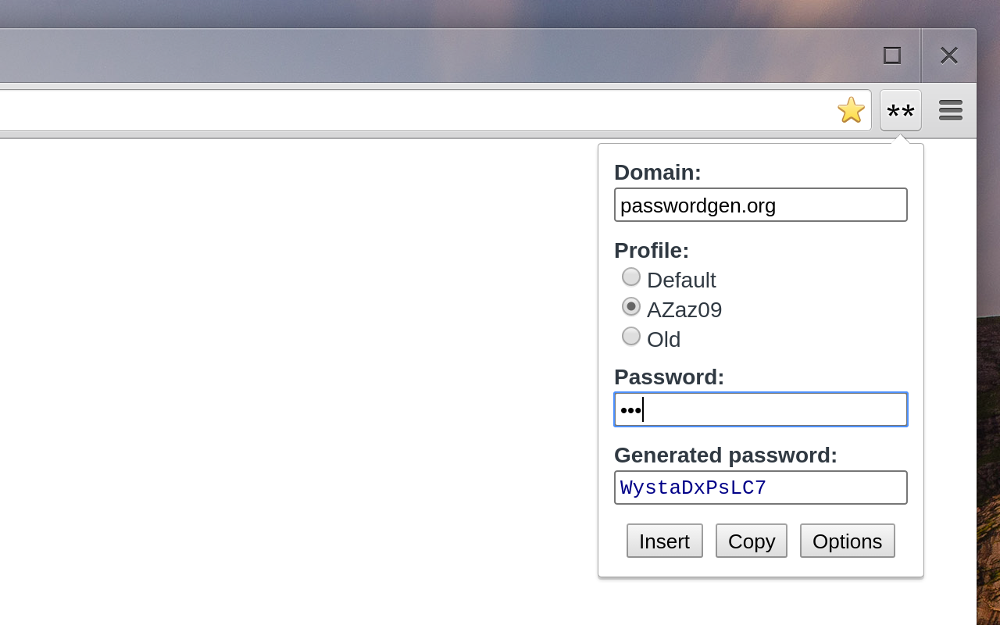
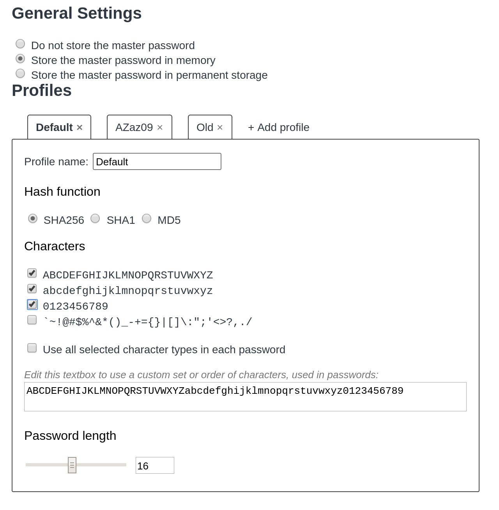

Password Generator
==================

Generate unique passwords based on one master password and website domains. This service is available online at <http://passwordgen.org> and as [an extension for Chrome](https://chrome.google.com/webstore/detail/password-generator/klfojgipmkdgfmikjfdhhkjlfeboaoij).

The password for each website is generated as a cryptographic hash function from its domain and a master password. Currently MD5, SHA1 and SHA256 are available. When SHA3 is officially released, it will also be added.

Please see the [About page](http://passwordgen.org/index.html) for the feature list.

Table of Contents
-----------------
- [Screenshots](#screenshots)
- [How to build](#build)
- [TODO](#todo)
- [Acknowledgements](#acknowledgements)

<a name="screenshots">
Screenshots
-----------

Here's the popup used to generate and insert the password into the fields on the page:

And here's the extension options page:

<a name="build">
How to build
------------

Both website and extension versions work directly from the repository, but it is also possible to create an extension ZIP-file. To do it, first pull the repository with the submodules:

    git pull --recurse-submodules https://github.com/eterevsky/passwordgen.git

Then run the build script:

    python3 build.py

<a name="todo">
TODO
----

Add password verification (check password entered in the popup).

<a name="acknowledgements">
Acknowledgements
----------------

The idea of generating passwords based on site domains is taken from [PasswordMaker](http://passwordmaker.org).

[jshash](http://pajhome.org.uk/crypt/md5/scripts.html) library by Paul Johnson aka Paj is used to compute hash functions.
